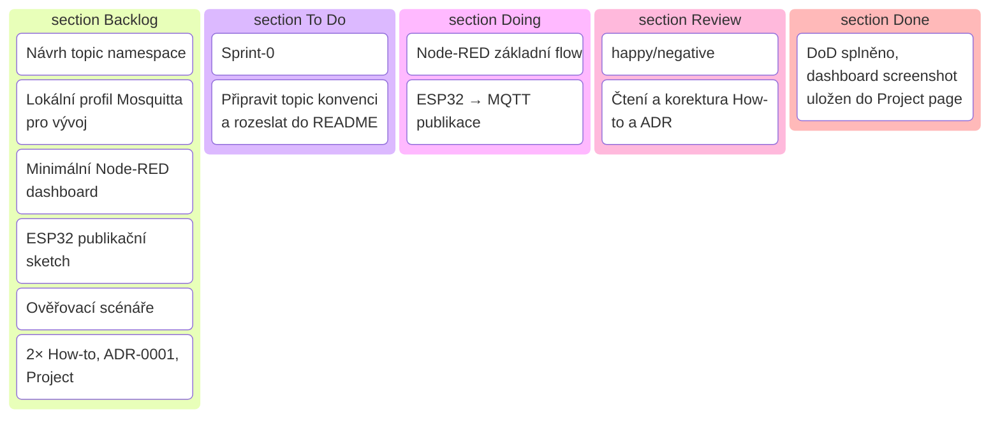

# Sprint 1 — Lokální MQTT tok (ESP32 → Mosquitto → Node-RED)

!!! info "Kontext a cíl"
        Výchozí stav: Docker stack s Mosquitto a Node-RED z Sprint-0 běží na localhostu.
    
        Cíl: Vést první reálný datový tok z ESP32 do MQTT a vizualizovat ho v Node-RED dashboardu + založit minimální dokumentaci (How-to, ADR, Project page).
    
        Proč takto: Je to nejkratší „end-to-end“ výsledek, na který se později bezpečně vrství zabezpečení, historizace a další integrace.

---

## Přehled kroků (high-level)

| # | Co | Proč |
|---|----|------|
| 1 | Ověřit stav stacku z Sprint-0 (porty 1883/1880, logy) | Minimalizace šumu – ať nehoníš chybu jinde. |
| 2 | Navrhnout topic namespace | Stabilní jmenný prostor šetří refaktoring a debug. |
| 3 | Nastavit Mosquitto pro lokální vývoj | Transparentní testy, později snadná výměna za TLS. |
| 4 | Připravit Node-RED dashboard (1 graf, 1 text) | Rychlá vizuální zpětná vazba. |
| 5 | Publikovat z ESP32 periodická data | První skutečný producent dat, test stabilní konektivity. |
| 6 | Ověřit tok (MQTT Explorer, Node-RED, logy) | Uzavření smyčky, „Definition of Done“. |
| 7 | Založit dokumentaci (How-to, ADR, Project page) | Udržitelnost, přenositelnost, opakovatelnost. |

---

## Krok-po-kroku (detail)

### 1) Ověření stacku ze Sprint-0
Zkontroluj běh obou kontejnerů, mapované porty 1883 (MQTT) a 1880 (Node-RED), logy Mosquitta bez „local only mode…“, dostupnost Node-RED UI.
Proč: Eliminuješ falešné chyby v dalších krocích. Vzor kontrol najdeš ve Sprint-0 (sekce „Ověření běhu…“).

### 2) Návrh topic namespace (minimální konvence)
Podrobný návod a doporučené konvence najdeš v [How-to: Návrh MQTT namespace](../how-to/mqtt-namespace.md).

Princip: `v1/<org>/<site>/<device>/<channel>/<metric>`
Příklad: `v1/home/lab/esp32-01/tele/temperature`
Doplňky: QoS 0, retain jen pro „poslední známou hodnotu“.
Proč: Jednou zvolený pattern snižuje budoucí drift v Node-RED flow a v InfluxDB/Power BI.

### 2a) Last Will & Testament (LWT) v MQTT

Podrobný popis a příklad nastavení LWT najdeš v [Reference: LWT v MQTT](../reference/mqtt-lwt.md).

### 3) Mosquitto – lokální vývojový profil
Cíl: Lokální broker akceptuje připojení z hostitele i ESP32 v LAN bez TLS, volitelně s heslem.
Proč ESP32? Viz [ADR 0003: Volba platformy pro edge zařízení — ESP32](../adr/adr-0003-esp32.md).
Postup a minimální config najdeš v [How-to: Mosquitto – lokální vývojový profil](../how-to/mosquitto-lokalni-profil.md). Po nasazení zkontroluj log, aby neběželo „local only mode“.
Minimální nastavení: listener na 1883, persistence on, log do souboru, allow_anonymous (jen pro lab). Vzor i typické chybové stavy máš popsány ve Sprint-0.
Pro základní nastavení a spuštění ESP32 použij:
- [How-to: ESP32 → MQTT v Pythonu (MicroPython)](../how-to/esp32-micropython-mqtt.md)
Proč: Stabilní lokální playground; bezpečnost (TLS, ACL, password_file) přidáš ve Sprintu 4.

### 4) Node-RED – základní flow + dashboard
Cíl: Jednoduchý tok „MQTT in → (optional transform) → text + chart“.
MQTT in: subscribe na konkrétní topic z bodu 2.
Transform: jednoduchý převod na číslo + timestamp (kvůli grafu).
Dashboard: jeden „text“ (aktuální hodnota) a jeden „chart“ (posledních X minut).
Proč: Vidíš živá data bez složitostí.

### 5) ESP32 – publikace telemetrie

Cíl: Každých 5–10 s poslat metrickou hodnotu na zvolený topic.
Parametry: SSID/heslo, IP brokera (lokální), clientId, keepalive ~60 s, last-will (volitelné).
Proč: Ověříš realitu (Wi-Fi, MQTT reconnect, latence), ne jen lab s PC.

Vyber jednu z variant: MicroPython / ESPHome / Tasmota / PlatformIO. Přehled a ready-to-run návody najdeš v [ESP32 → MQTT – varianty](../how-to/esp32-mqtt-varianty.md).

---

### 5a) ESP32 – flashni minimální profil (varianty)

Použij hotový základ z vybrané varianty:
- [MicroPython](../how-to/esp32-micropython-mqtt.md)
- [ESPHome](../how-to/esphome-esp32-mqtt.md)
- [Tasmota](../how-to/tasmota-esp32-mqtt.md)
- [PlatformIO/Arduino](../how-to/platformio-esp32-mqtt.md)

Uprav Wi-Fi, MQTT a device ID. LWT: .../meta/status posílá ONLINE (retained) po připojení a broker publikuje OFFLINE (retained) při pádu/odpojení. Topics: vždy `v1/<org>/<site>/<device>/<channel>/<metric>`, telemetrie každých 5 s, QoS 0, retain pouze pro status.

### 5b) ESP32 – mini-sketch (Arduino/PlatformIO)

Pro Arduino/PlatformIO použij [How-to: ESP32 → MQTT (mini-sketch)](../how-to/esp32-mqtt.md) a sjednoť topics podle konvence.

### 5a) ESP32 – flashni minimální sketch

Použij hotový základ z [How-to: ESP32 → MQTT (mini-sketch)](../how-to/esp32-mqtt.md).

Uprav WIFI_SSID, WIFI_PASS, MQTT_HOST, CLIENT_ID.

Ujisti se, že topic odpovídá dohodnuté konvenci z kroku 2.

LWT: .../meta/status posílá ONLINE (retained) po připojení a broker publikuje OFFLINE (retained) při pádu/odpojení.

Definition of Done (rozšíření):

.../meta/status má správný stav (ONLINE/OFFLINE, retained).

MQTT Explorer ukazuje telemetrii i status v reálném čase; Node‑RED dashboard reaguje do 2 s.

### 6) End-to-end ověření
MQTT Explorer: subscribe na vybraný topic, sleduj payload, Node-RED dashboard zobrazuje živý text i graf, logy Mosquitta kontrolují připojení klienta ESP32.
Proč: Potvrzení, že vše (síť, broker, transformace, UI) drží pohromadě.

### 7) Dokumentace
Vytvoř 3 minimální stránky (How-to, ADR, Project):
- How-to: „Mosquitto – lokální broker“ (setup + ověření)
- How-to: „Node-RED – základní flow a dashboard“
- ADR-0001 „Volba stacku“
- Project „Sprint-1“ – cíl, přínos, odkazy na How-to, DoD

---

## Definition of Done (DoD)
- MQTT Explorer zobrazuje data z ESP32 v reálném čase na dohodnutém topicu.
- Node-RED dashboard: 1 text + 1 graf, aktualizace do 2 s od publikace.
- .../meta/status má správný stav (ONLINE/OFFLINE, retained).
- MQTT Explorer ukazuje telemetrii i status v reálném čase; Node‑RED dashboard reaguje do 2 s.
- Repo/web obsahují: 2× How-to, 1× ADR, 1× Project page s odkazy.

---

## Ověření a testy (rychlé scénáře)
- „Happy path“: ESP32 běží 10 minut, žádný reconnect; graf průběžně roste.
- Reconnect test: restart brokera; ESP32 do 30 s znovu připojen a publikuje.
- Data test: payload je číslo nebo jednoduchý JSON s hodnotou + timestamp; Node-RED převod funguje.
- Negativní: změna topicu na nesprávný → dashboard nic nezobrazuje (očekávané).

---

## Rollback / Cleanup
- Zastavení stacku a vyčištění svazků pro „čistý start“ (viz Sprint-0 „Čištění“).
- ESP32: revert sketch na „no-op“ (nepublikuje nic).
- Dokumentace: ponech ADR/Project, How-to označ jako „WIP“ (label v hlavičce).

---

## Rizika a mitigace
- Chybné mapování portů nebo prázdný config Mosquitta → broker nenaběhne správně; kontroluj log a existenci configu.
- Nestabilní Wi-Fi → krátké publish intervaly odhalí reconnecty; přidej last-will.
- Nekonzistentní topic names → od začátku drž konvenci z kroku 2.

---

## Kanban (návrh WIP-friendly toku)

---

## Odkazy a zdroje
- [How-to: Instalace Mosquitto](../how-to/instalace-mosquitto.md)
- [How-to: Node-RED základní flow](../how-to/node-red-zakladni-flow.md)
- [How-to: ESP32 → MQTT](../how-to/esp32-mqtt.md)
- [ADR-0001: Volba stacku](../adr/adr-0001-volba-stacku.md)