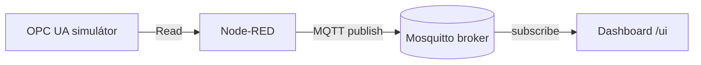

# Sprint 2 — OPC UA simulace + bridge do MQTT

!!! info "Jednou větou"
    Čtení dat z OPC UA simulátoru a jejich přenos do MQTT přes Node-RED bridge.

---

## Kontext
- **Výchozí stav:** Funkční MQTT tok, základní dashboard, dokumentace k labu.
- **Cíl:** Naučit se získávat data z OPC UA serveru a posílat je do MQTT, včetně základní analýzy provozních dat.
- **Proč teď:** OPC UA je klíčový průmyslový protokol, most do MQTT umožní další integrace a analytiku.

---

## Architektura

---

## Postup (hlavní kroky)

| Krok | Popis | Odkaz na How-to |
|------|-------|-----------------|
| 1 | Instalace a spuštění OPC UA simulátoru (např. Prosys) | – |
| 2 | Node-RED: OPC UA client → načtení proměnných | OPC UA → MQTT bridge |
| 3 | Node-RED: MQTT publish do brokeru | OPC UA → MQTT bridge |
| 4 | MQTT Explorer: ověření dat z OPC UA v MQTT | MQTT Explorer |
| 5 | Dokumentace – How-to, ADR, Project update | ADR, How-to |

---

## Výsledek
- Data z OPC UA jsou vidět v MQTT Exploreru.
- Node-RED bridge běží automaticky po restartu.
- Web obsahuje nové How-to a ADR pro OPC UA → MQTT.

---

## Rizika / Lessons learned
- Kompatibilita OPC UA klienta a serveru.
- Správné mapování proměnných do MQTT témat.
- Automatizace spuštění Node-RED bridge.

---

## Další kroky
- Sprint 3: Ukládání dat do InfluxDB, napojení na cloudový MQTT.
- Rozšířit dashboard o historická data.
