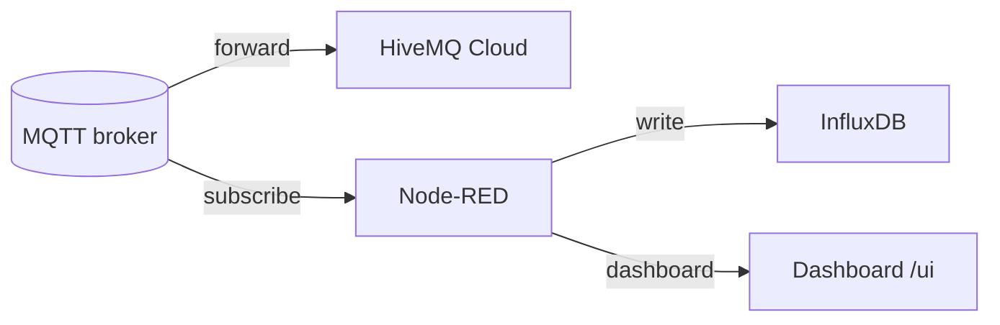

# Sprint 3 — MQTT do cloudu + historická data

!!! info "Jednou větou"
    Posílání dat z lokálního MQTT brokeru do cloudového MQTT a ukládání do časové databáze (InfluxDB).

---

## Kontext
- **Výchozí stav:** Data z OPC UA jsou v MQTT, základní dashboard a dokumentace hotová.
- **Cíl:** Umožnit ukládání historických dat a přenos vybraných témat do cloudu (HiveMQ Cloud).
- **Proč teď:** Historie a cloudová integrace jsou klíčové pro analytiku a škálování řešení.

---

## Architektura

---

## Postup (hlavní kroky)

| Krok | Popis | Odkaz na How-to |
|------|-------|-----------------|
| 1 | Nastavení forwardingu MQTT do HiveMQ Cloud | HiveMQ napojení |
| 2 | Instalace a konfigurace InfluxDB | InfluxDB instalace |
| 3 | Node-RED: ukládání dat do InfluxDB | Node-RED → InfluxDB |
| 4 | Dashboard: zobrazení historických dat | Node-RED dashboard |
| 5 | Dokumentace – How-to, ADR, Project update | ADR, How-to |

---

## Výsledek
- Data jsou vidět v HiveMQ Cloud klientu.
- InfluxDB obsahuje historická data z posledních 24h.
- Web má nové How-to a ADR k architektuře brokeru.

---

## Rizika / Lessons learned
- Správné nastavení forwardingu MQTT.
- Kompatibilita Node-RED a InfluxDB.
- Bezpečnostní aspekty cloudového přenosu.

---

## Další kroky
- Sprint 4: Základy bezpečnosti (TLS, VLAN, firewall).
- Rozšířit dashboard o pokročilé vizualizace.
