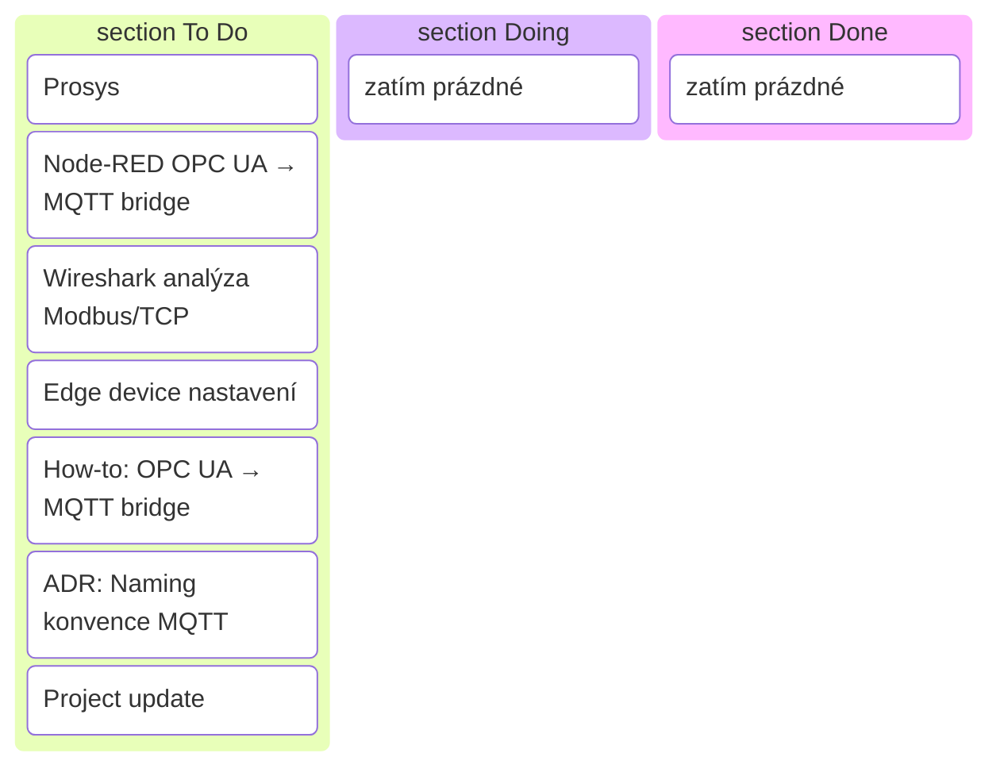

# Sprint 2 — OPC UA simulace + bridge do MQTT (šablona)

!!! info "Cíl sprintu"
        Umět číst data z OPC UA simulátoru a posílat je přes Node-RED bridge do MQTT brokeru.

---

## Backlog (To Do)

| Kategorie      | Úkol                         | Popis / Akceptační kritéria | Odhad |
|----------------|------------------------------|-----------------------------|-------|
| **Technika**   | OPC UA simulace (Prosys)     | Server běží, vidíš proměnné (např. rychlost vřetena, teplota) v OPC UA klientu | 1 den |
|                | Node-RED OPC UA → MQTT bridge| Flow, který subscribuje OPC UA hodnoty a publikuje do MQTT | 1 den |
|                | Wireshark analýza Modbus/TCP | Zachytit a rozebrat komunikaci (min. 1 požadavek + odpověď) | 1 den |
|                | Edge device nastavení        | Základní Linux admin, firewall, autostart aplikací po rebootu | 1 den |
| **Dokumentace**| [How-to: OPC UA → MQTT bridge](../how-to/opcua-mqtt-bridge.md) | Účel, kroky, ověření, rollback | 0,5 dne |
|                | ADR: Naming konvence MQTT    | Namespace, QoS politika, důsledky | 0,5 dne |
|                | Project update               | Doplnit architekturu o OPC UA vrstvu | 0,5 dne |

---

## Kritéria pro review

- MQTT Explorer ukazuje témata z OPC UA serveru.
- Node-RED bridge běží automaticky po restartu.
- Na webu je How-to pro OPC UA → MQTT a ADR pro MQTT naming.

---

## Rizika

- Komunikační problémy mezi OPC UA a MQTT (firewall, špatné adresy)
- Chyby v Node-RED flow (špatné mapování hodnot)
- Nedostatečné logování a monitoring

---

## Kanban (vizualizace)

---

> Konkrétní realizace sprintu najdeš v sekci [Projects](../projects/).
