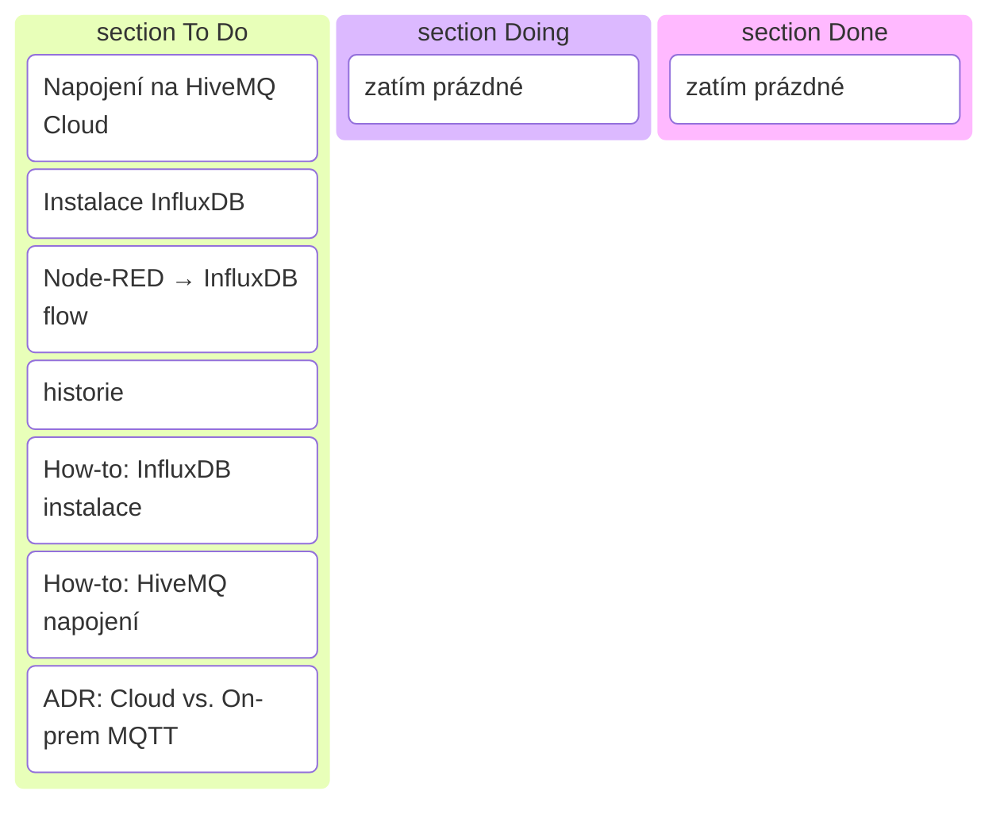

# Sprint 3 — MQTT do cloudu + historická data (šablona)

!!! info "Cíl sprintu"
        Posílat data z lokálního brokeru do cloudového MQTT a ukládat je do časové databáze (InfluxDB).

---

## Backlog (To Do)

| Kategorie      | Úkol                         | Popis / Akceptační kritéria | Odhad |
|----------------|------------------------------|-----------------------------|-------|
| **Technika**   | Napojení na HiveMQ Cloud     | Lokální broker forwarduje vybraná témata do HiveMQ Cloud | 1 den |
|                | Instalace InfluxDB           | Lokální instance běží, přijímá data z Node-RED | 0,5 dne |
|                | Node-RED → InfluxDB flow     | Ukládá min. 3 signály s timestampem | 1 den |
|                | Node-RED dashboard (historie)| Graf z InfluxDB (posledních 24h) | 0,5 dne |
| **Dokumentace**| [How-to: InfluxDB instalace](../how-to/influxdb-instalace.md)    | Účel, kroky, ověření, rollback | 0,5 dne |
|                | [How-to: HiveMQ napojení](../how-to/hivemq-napojeni.md)      | Účel, kroky, ověření, rollback | 0,5 dne |
|                | ADR: Cloud vs. On-prem MQTT  | Kritéria, důsledky, bezpečnost | 0,5 dne |

---

## Kritéria pro review

- Data jsou vidět v HiveMQ Cloud klientu.
- InfluxDB obsahuje historická data z posledních 24h.
- Web má 2 nové How-to a ADR k architektuře brokeru.

---

## Rizika

- Problémy s připojením na cloudový broker (firewall, špatné credentials)
- Chyby v Node-RED flow (špatné ukládání do InfluxDB)
- Nedostatečné zabezpečení dat při přenosu do cloudu

---

## Kanban (vizualizace)

---

> Konkrétní realizace sprintu najdeš v sekci [Projects](../projects/).
