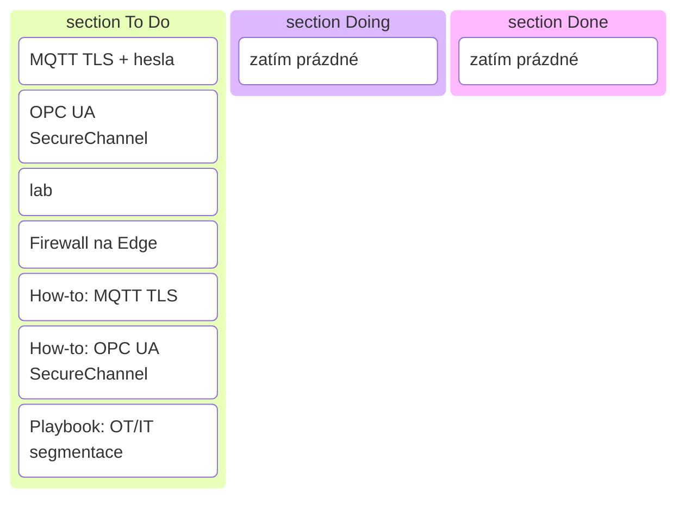

# Sprint 4 — Základy bezpečnosti OT ↔ IT (šablona)

!!! info "Cíl sprintu"
        Přidat základní bezpečnostní opatření (TLS, autentizace, VLAN segmentace) do současné architektury.

---

## Backlog (To Do)

| Kategorie      | Úkol                         | Popis / Akceptační kritéria | Odhad |
|----------------|------------------------------|-----------------------------|-------|
| **Technika**   | MQTT TLS + hesla             | Broker vyžaduje TLS a auth pro přístup | 1 den |
|                | OPC UA SecureChannel         | Povolit šifrování a auth v OPC UA serveru | 0,5 dne |
|                | VLAN segmentace (lab)        | Oddělené VLAN pro OT/IT, ping test | 1 den |
|                | Firewall na Edge             | Otevřené jen nezbytné porty | 0,5 dne |
| **Dokumentace**| [How-to: Mosquitto Security](../how-to/mosquitto-security.md)              | Účel, kroky, ověření, rollback | 0,5 dne |
|                | [How-to: OPC UA SecureChannel](../how-to/opcua-securechannel.md) | Účel, kroky, ověření, rollback | 0,5 dne |
|                | [Playbook: OT/IT segmentace](../playbooks/ot-it-segmentace.md)   | Postup, schéma, testy | 0,5 dne |

---

## Kritéria pro review

- MQTT Explorer připojí jen klient s certifikátem/heslem.
- OPC UA klient se připojí jen přes zabezpečený kanál.
- VLAN funguje (OT → IT jen přes Edge).
- Web má 3 nové bezpečnostní návody.

---

## Rizika

- Chyby v konfiguraci TLS mohou znemožnit připojení klientů
- Nesprávné nastavení VLAN může způsobit ztrátu konektivity
- Nedostatečné zabezpečení hesel nebo certifikátů

---

## Kanban (vizualizace)

---

> Konkrétní realizace sprintu najdeš v sekci [Projects](../projects/).
